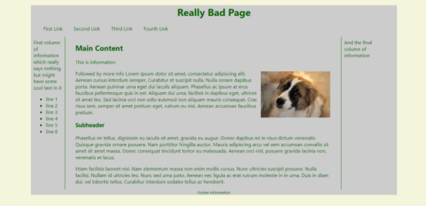
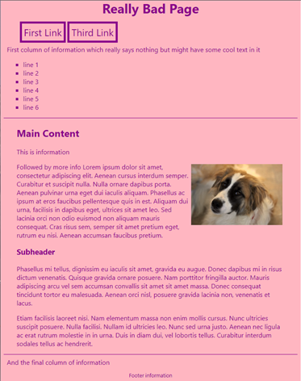
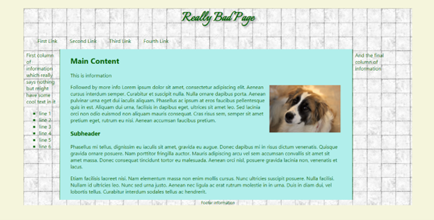
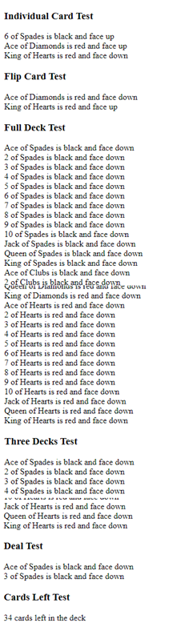

# _Web Programming III (420-H30-HR)_

# _Lab 1 – Review_

Date due: **Friday, August 23, 2024, at 11:59 p.m.**

**Learning Objectives**

Upon successful completion of this lab exercise, the student will have:

- Reviewed HTML and CSS from Web Programming I
- Reviewed Responsive Web Design from Web Programming I
- Reviewed JavaScript from Web Programming II

Set up:

1. Follow the link on Moodle to accept the Assignment
2. In VS Code or (your preferred IDE), clone the lab repository that is created automatically from the previous step
3. The files required for the lab should now be available in your preferred repository destination.

It is up to you what tools you want to use for the lab. Likely this will be either WebStorm or Visual Studio Code.

To do:

**Part A – HTML and CSS Review**

1. Open the folder **\\H30L01_files\\partA** that you created during the Lab Setup step above.
2. Open the file **badIdea.html** in a web browser and whatever editor you are using. The page was developed using an obsolete technique (HTML Table). Your job is to take the garbage that is this page and recreate it using appropriate CSS techniques and design. A few things to keep in mind:
    a. The image must be moved to an images folder.
    b. No outdated or deprecated (or repulsive) tags are allowed in the completed web page.
    c. No inline or embedded CSS is allowed in the completed web page.
    d. Your style sheet must be kept in a separate folder called **styles**
    e. There should NOT be a table in the final web page, but a container div that is used to format the overall width and background colour of the section.
    f. The final page should consist of:
        i. A &lt;header&gt; section for the page header.
        ii. A &lt;nav&gt; section for the navigation.
        iii. Three divs, side by side, containing the content.
            1. The left div contains the “first column” information. The width of both the left and right is 8% and they both have a margin of 0.5em on all sides.
            2. The middle div will have:
                i. The h2 tag, the paragraphs and the image.
                ii. The div should also have the h3 and the two paragraphs following.
                iii. a width of 70% of the full container width.
                iv. a border on the left and right side of 1px width, solid in darkgreen colour.
                v. a left and right padding of 2em.
            3. The right div contains the third column of information.

            **HINT**: Remember a div is a block-level element; in order to put them horizontally you can use CSS Flexbox.

                1. The image in the middle div is floated to the right side of the div and has a padding of 0.3 em.
                2. A &lt;footer&gt; element with the footer information. Make the font size .8em or 80% for the font size in the footer.
    g. Hyperlinks in the nav section should not be formatted with **&nbsp;** but must be a list that is displayed horizontally with a right padding of 2em.

    **NOTE**:

        - For complete marks, make sure that the last link does NOT have any right padding. (Hint: you can use the CSS property [:not(:last-child)](https://www.geeksforgeeks.org/css-notlast-childafter-selector/))
        - The hyperlinks should not be underlined, nor should they be blue.
        - Hyperlinks should be the default font colour. When they are hovered over, they should grow to a size 5% larger (1.05em or 105%) and change to black colour. (Hint: consider using **transform: scale(105)**)
        - The &lt;nav&gt; should be styled to have a left and bottom margin of 2em and 1.5em respectively.
    h. The 6 lines prefixed with dashes in the left side should be an unordered list and use the disc for the list prefix.
    i. Use classes and ids as you see fit.

The final page looks like the following screenshot:

**Part B – Responsive Web Design**

1. Open the folder **\\420-H30\\Labs\\YourFirstInitialYourLastName_H30L01\\partB** that you created above.
2. Copy the files and folders from partA to the partB folder (badIdea.html and the two folders: images and styles). Note: There is already an images folder so merge the two folders. **Make sure you are editing the correct file.**
3. You are going to have to copy some things around in the CSS file to accommodate mobile first design. First add a media query AT THE BOTTOM of your CSS add a media query for all devices with a minimum width of 768px.
    a. Copy all the rules you created in the part A to this section to this query section.
    NOTE: **COPY** the rules, but do not delete them from the top section. You will be changing the ones at the top in the next section.

4. Change the rules outside the media query section (at the top of the CSS file) as follows:
    a. Change the background colour for the entire page (body) to be lightpink and the font colour to be darkmagenta.
    b. In the container div (the outer div) change the width to auto and remove the background colour.
    c. In the HTML file, add the class “notmobile” to the list items surrounding the 2nd and 4th menu items. In the CSS file, add a class called notmobile to the top section which turns off the display of the elements with that class (display: none).
    d. For the list items in the nav bar, make the font size 1.5em, add a padding on all sides of 0.2em and add a thick, solid border in darkmagenta to all sides.
    e. Remove the 0 right padding from the last list item (remove the rule completely).
    f. Remove the hover rule for the anchor tags.
    g. In the left, right and middle divs, remove the width and float properties so that the three divs are one after another on the page. If you used CSS flexbox, set the flex direction of the content div to column.
    **Note**: No need to remove float property from the image (img) in the middle div (see screenshot below).
    h. For the middle div, change the left and right border properties to be top and bottom border properties and change the colour of the border to be darkmagenta.

5. The completed page should look like this when the window is narrowed to less that 768 pixels:

   

6. To make sure that the original page looks the same as in the previous section and to make sure we are not repeating rules, there are some changes to be made to the section within the media query of 768px.
    a. Remove the font-family (as it is being done in the original section).
    b. Add a .notmobile class with the display property of inline.
    c. Add a border property to the list items for the nav class and set it to none
    d. Also add a font-size of inherit to the nav class list items.
    e. Add a border-top and bottom property to the middle div properties and set both to none.
    f. (OPTIONAL) Remove the rules setting the list style type of the unordered list in the left side.
    g. Remove the image tag and the footer section.
    h. The page should now look exactly like the one from section B when the browser is wider than 768 pixels.
    i. If you used CSS flexbox, set the flex direction of the content div to row.
7. Add a second media query to the bottom of the CSS file (below the end of the last media query) for all devices with a minimum width of 1500px. All the following CSS properties must be set within this media query (only include the properties listed in the media query; do NOT add any others):
    a. The container element is going to use the background image bg.jpg from the images folder.
    b. The h1 element is going to change to use the font family ‘Italianno’, cursive, has a font size of 3em and a text shadow of 4px to the right, 4 px down, 4 px wide in the colour #AAA. Note, the quotes around ‘Italianno’ are required.
        1. The font ‘Italianno’ is not available on the computer, but is available over the internet from Google. To use the Google font set ‘Italianno’ you must import the Google font api into the top of your CSS page. So, to the top of the CSS page, add:  
            @import url('<https://fonts.googleapis.com/css2?family=Italianno&display=swap>');
    c. The middle div has a background colour using rgb of 177, 238, 235.

8. The completed page should look like this when the browser is wider than 1499px:

**Part C – JavaScript Review**

1. Open the folder **\\420-H30\\Labs\\YourFirstInitialYourLastName_H30L01\\partC** that you created during the Lab Setup step above. It contains a file called partc.html. This is the file that you must run for this section. You can NOT make any changes to this file. This file reads in two JavaScript files. The file partc.js is the test file and cannot be changed. You will be creating the file Card.js; make sure it is in the correct subfolder.
2. Create a file (in the appropriate location) called Card.js (note the case of the file name). Add the following:
    a. A ‘const’ant array called SUITS which contains the strings Spades, Clubs, Diamonds and Hearts IN THAT ORDER.
    b. A ‘const’ant array called RANKS which contains: “Ace”, 2, 3, 4, 5, 6, 7, 8, 9, 10, “Jack”, “Queen”, “King” (a mix of strings and numbers) IN THAT ORDER.
    c. A ‘const’ant array called COLOURS which contains the strings “black” and “red” IN THAT ORDER.
    d. Create a class called Card which has a constructor with 4 parameters suit, rank, colour and faceup. The faceup parameter defaults to false. Use backing fields for the parameter assignment in the constructor and add accessors and mutators for all the fields. The first three parameters are NUMBERS and the last parameter is a BOOLEAN.
    e. Add a function called getStringVal which returns the string: ‘rank of suit’; for example 2 of Spades or King of Hearts. Use the constant arrays to return the values.
    f. Add a function called getCardColour which returns the string value of the colour. Use the constant array to get the value.
    g. Add a function called flipCard which flips (sets) the card faceup or facedown depending on what it currently is.
    h. After the Card class add a second class called Deck. The constructor has one parameter ‘num’ which defaults to one and is the number of decks to create.
    i. The constructor for the Deck class does the following:
        i. Creates an empty array called cards belonging to the Deck object.
        ii. Creates an attribute (variable) called position set to 0 belonging to the Deck object.
        iii. Uses a nested \[for\] loop for the number of decks (parameter passed to the constructor), the number of suits (use the length of the SUITS array) and the number of ranks (use the length of the RANKS array) to create a new Card object at the current position and increment the position. Set the colour based on the suit value (black for spades and clubs, red otherwise). REMEMBER: The attributes for the card are NUMBERS, NOT STRINGS.
        iv. Resets the position attribute to 0 (first card in the deck).
    j. Add a method to the Deck class called dealCard which returns the top card from the deck and removes it from the deck (use the appropriate array function – Hint: one of shift or pop).
3. Use the partc.html file that was provided created to run the code in the browser. The output is as follows (the gap from 2 of Clubs to Queen of Diamonds contains all the cards in between and the gap from 4 of Spades to Jack of Hearts is a list of **three** full decks):

**To submit**

When you have completed the lab exercise run the following git commands in order in your VS code (IDE) terminal: 
`
git add .
git commit -am "Completed lab 1"
git push
`
Call the teacher's attention to demo your work.
